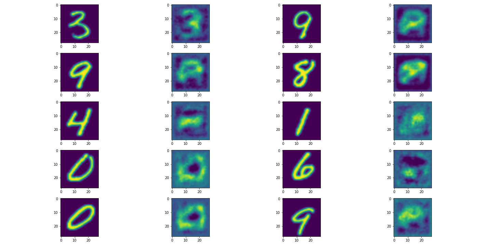

# NoPeekNN

PyTorch implementation of [NoPeekNN][nopeek],
currently trained on MNIST.
We implement a black box model inversion attack
to validate the protection afforded by [NoPeek].

This implementation uses [`PySyft`][syft] to simulate distributed training,
as would happen in applied SplitNN.



## What is NoPeekNN?
[NoPeekNN][nopeek] is an extension to [SplitNNs][splitnn] to preserve privacy.
While [SplitNNs][splitnn] do not send raw data to a potentially
untrustworthy central server,
it has been shown that raw data can be reverse engineered from the model.
[NoPeekNN][nopeek] attempts to limit this by training the model to produce
an intermediate data representation (sent between model parts)
as distinct from the input data as possible
while retaining the information necessary to successfully complete the task.

This is achieved by adding a term to the loss function which minimises
_distance covariance_ between the input and intermediate data.

## Requirements
This code has been written in `python 3.7` and `PyTorch 1.5.0`,
however other versions may work.

If using conda,
run
```bash
conda env create -f environment.yml
```
to create an environment,
`nopeek`,
with all the necessary packages.

Run
```bash
conda env create -f environment-lock.yml
```
to create an environment with the exact package versions
used to develop this code.

## Get started
To train a SplitNN on MNIST with a NoPeekLoss,
un `python main.py --nopeek_weight <weight>`
where `<weight>` is a float.

Models are saved to the [`models/`](models) directory.
We have provided a selection of trained models.

See other optional arguments with `python main.py --help`.

Trained

NoPeek loss is computationally demanding and
scales with the size of a data batch,
so it is recommended to stick to small (<64) batch sizes.


[nopeek]: https://aiforsocialgood.github.io/iclr2019/accepted/track1/pdfs/29_aisg_iclr2019.pdf
[splitnn]: https://arxiv.org/pdf/1812.00564.pdf

[syft]: https://github.com/OpenMined/PySyft